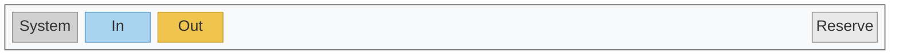
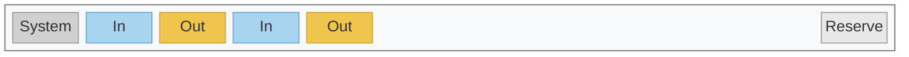
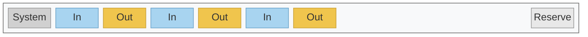
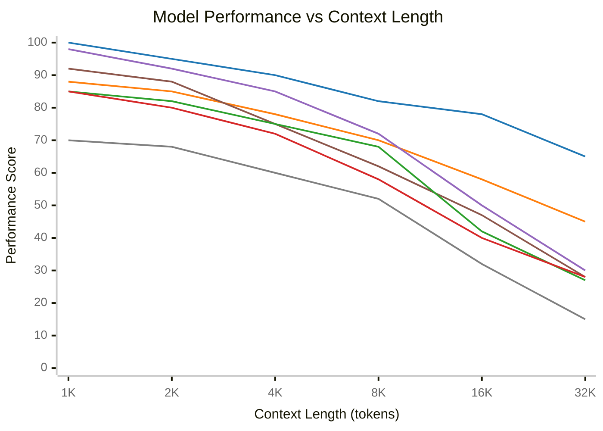

# Контекстное окно

## Что такое контекстное окно?

Контекстное окно - это "рабочая память" модели. Все, что модель знает о вашей задаче, должно поместиться в это окно. Это отличается от данных, на которых модель обучалась.

## Как растет контекст

### Ход 1

### Ход 2

### Ход 3

**200K токенов** - контекстное окно для моделей Claude 4.5

**Ключевые моменты:**

- **Накопление токенов:** С каждым ходом беседы сообщения пользователя и ответы ассистента накапливаются в контекстном окне. Предыдущие ходы сохраняются полностью.
- **Линейный рост:** Использование контекста растет линейно с каждым ходом.

## Деградация качества при росте контекста

NoLiMa Benchmark Results (arXiv:2502.05167, March 2025)

| Model | Context Window | 1K | 32K | Падение |
|-------|----------------|-----|------|---------|
|  GPT-4o | 128K | 100% | 65% | -35% |
|  GPT-4o mini | 128K | 88% | 45% | -43% |
|  Llama 3.3 70B | 128K | 98% | 30% | -68% |
|  Llama 3.1 405B | 128K | 92% | 28% | -64% |
|  Gemini 1.5 Pro | 2M | 85% | 27% | -58% |
|  Claude 3.5 Sonnet | 200K | 85% | 28% | -57% |
|  Gemini 1.5 Flash | 1M | 70% | 15% | -55% |

**Вывод:** Даже на 32K токенов (16% от заявленных 200K) производительность падает на 50-70%.

## Практические рекомендации

### 1. Давайте только необходимый контекст

Не загружайте "всю документацию на всякий случай". Чем меньше контекста - тем лучше модель работает. Давайте только то, что нужно для конкретной задачи.

### 2. Новая задача = новая беседа

После завершения задачи не продолжайте в той же беседе. Накопленный контекст (ваши вопросы, ответы модели, результаты поиска) снижает качество следующей задачи.

### 3. Используйте форки бесед

Если несколько задач требуют одинакового начального контекста (например, изучение документации проекта):

1. Создайте базовую беседу где модель изучила документацию
2. Для каждой новой задачи делайте форк от этой точки
3. Каждая задача выполняется в "чистом" контексте

