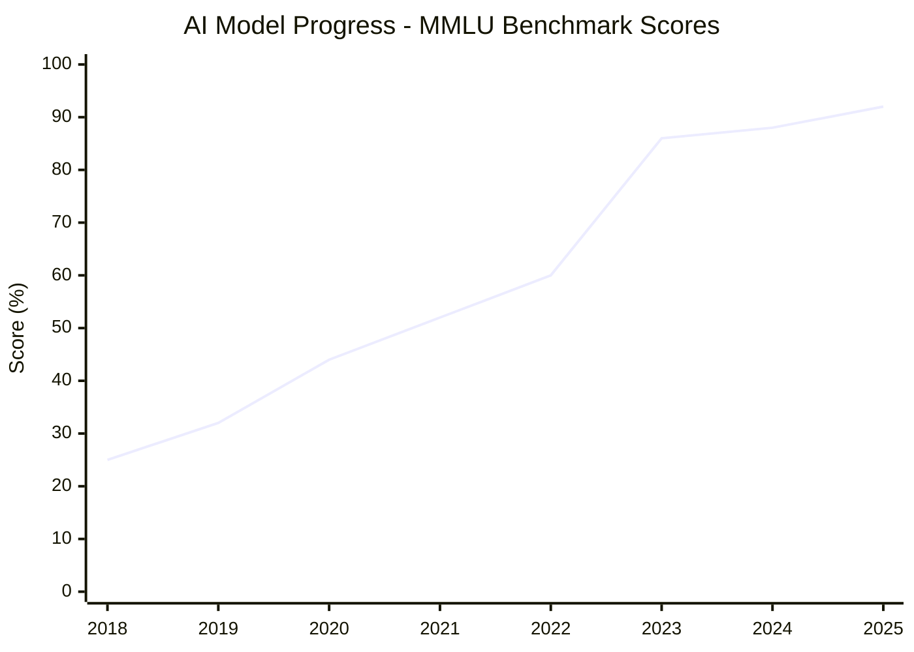
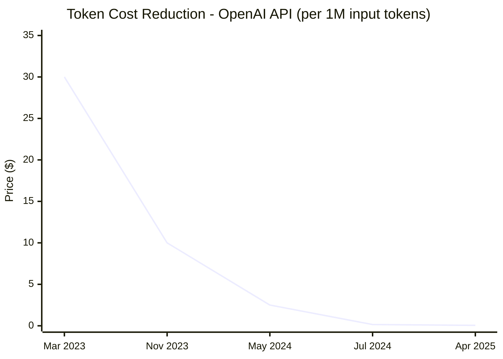

# Об этих уроках

## Тренды

### Скорость прогресса AI

**Ключевые модели:** GPT-1 (2018) → GPT-2 (2019) → GPT-3 (2020) → GPT-4 (2023) → GPT-4o (2024) → GPT-5 (2025)

*Training compute grows 100,000x per year since 2020*

### Стоимость токенов

**Эволюция моделей:** GPT-4 → GPT-4 Turbo → GPT-4o → GPT-4o Mini → GPT-5 Nano

*Снижение стоимости: 99.8% (в 600 раз дешевле) с марта 2023 по апрель 2025*

## Проблема

Распространенность информации очень низкая — нет профессионального образования в этой области. В микроблоге можно узнать больше, чем на платном курсе за 1000$.

## Решение: Культура

**Что делать, чтобы получать ценность от технологии как можно быстрее?**

Построить культуру обмена знаниями:
- Как кружки качества в Toyota
- Как книжный клуб в Нетриксе

**Суть подхода:**
- Я делюсь тем, что попробовал и что работает
- Но это лишь малая часть того, что происходит
- Есть много крутых инструментов, о которых я не слышал
- **Идея:** все делятся новыми подходами друг с другом → максимальная скорость адаптации
