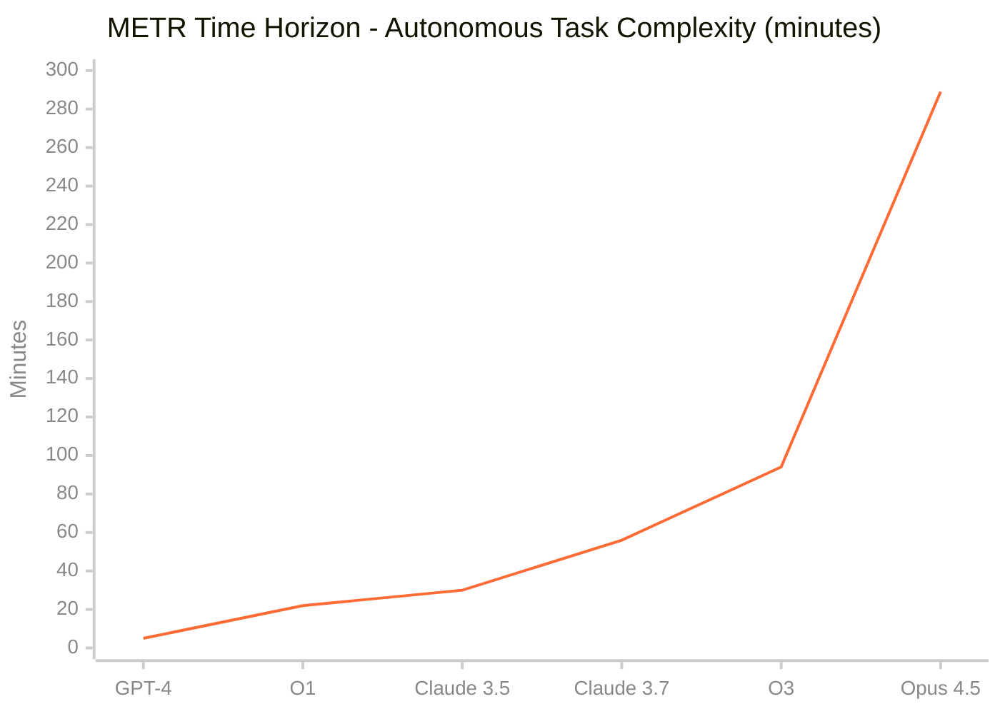
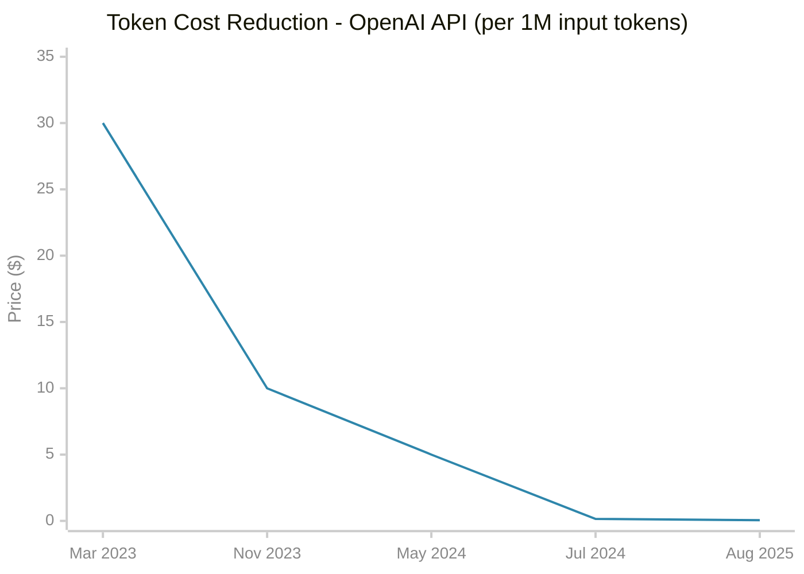

# Об этих уроках

## Тренды

### Скорость прогресса AI

**Что измеряет:** длительность задач (в минутах работы человека), которые AI может выполнить автономно с 50% надежностью

*Рост 58x за 2 года. Удвоение каждые 4-7 месяцев ([METR Research](https://metr.org/blog/2025-03-19-measuring-ai-ability-to-complete-long-tasks/))*

### Стоимость токенов

**Эволюция моделей:** GPT-4 ($30) → GPT-4 Turbo ($10) → GPT-4o ($5) → GPT-4o Mini ($0.15) → GPT-5 Nano ($0.05)

*Снижение стоимости: 99.8% (в 600 раз дешевле) с марта 2023 по август 2025*

## Проблема: обучение не успевает за технологией

**Раньше:** навыки устаревали за десятилетия. **Сейчас:** за 2-3 года, в AI - за месяцы.

> "Курс по ChatGPT в январе не готовит к ландшафту июня"
> -- [Aspen Institute](https://www.aspeninstitute.org/blog-posts/the-ai-upskilling-conundrum-are-we-falling-behind/)

Традиционное обучение не работает:
- Курс готовится 6+ месяцев - к релизу уже устарел
- Сертификации теряют смысл - инструменты меняются быстрее экзаменов
- Практики обгоняют преподавателей - кто реально использует AI, знает больше

**Результат:** 95% инвестиций в enterprise AI дают нулевой ROI ([MIT, 2025](https://www.mindtheproduct.com/why-most-ai-products-fail-key-findings-from-mits-2025-ai-report/)). Не потому что технология плохая - потому что люди не успевают учиться.

## Решение: культура обмена знаниями

**Идея:** если формальное обучение не успевает, нужен другой механизм - горизонтальный обмен внутри команды.

Это работает:
- **Toyota Kaizen** - непрерывное улучшение снизу вверх, а не сверху вниз
- **"Secret cyborgs"** ([Ethan Mollick, Wharton](https://www.insightpartners.com/ideas/ethan-mollick-on-ai/)) - сотрудники уже используют AI, но прячут это. Нужно создать среду, где они делятся

> "Peer learning exponentially more effective than top-down training"
> -- [McKinsey](https://www.mckinsey.com/capabilities/strategy-and-corporate-finance/our-insights/the-learning-organization-how-to-accelerate-ai-adoption)

**Суть подхода:**
- Кто-то попробовал новый инструмент - сразу рассказал остальным
- Скорость распространения знаний = скорость изменений технологии
- Не нужно ждать курса - знание передаётся за дни, не за месяцы

**Что может сделать руководитель:**
- Хакатоны и demo days - регулярная площадка для показа экспериментов
- "AI Office Hours" - еженедельные встречи где люди приносят реальные задачи
- Бюджет на эксперименты - право тратить время на пробы без KPI
- Награждать за обучение, не только за результат - кто научил других ценнее того, кто просто использует
- Психологическая безопасность - можно пробовать и ошибаться, не прятать использование AI
