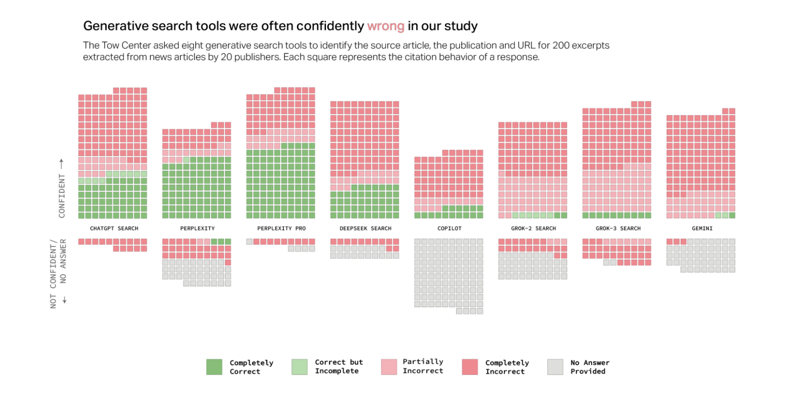

# Урок 10 -- Воркшоп: ресерч с AI (практика)

## Формат

- Теория (30 мин) -- live-ресерч и суммаризация информации
- Практика (1 ч)

## Требования к участникам

- Установленный и работающий OpenCode или Claude Code
- Установленные MCP: playwright, Kaiten (ссылка в уроке 8)
- Установленный glab для доступа к GitLab

## Поиск с AI

### Плюсы

- Быстро, легко, никакой когнитивной нагрузки -- сформулировал вопрос, получил ответ.

### Минусы

- Может уверенно выдавать неверные цитаты и ссылки. Сильно зависит от модели.
- Пример -- исследование Tow Center (Columbia Journalism Review, март 2025): 8 generative search tools протестировали на 200 выдержках из новостей; в большинстве случаев уверенные ответы были неверны.

Источник: https://www.cjr.org/tow_center/we-compared-eight-ai-search-engines-theyre-all-bad-at-citing-news.php

Типичный пример результата AI-ресерча: [agentic_ai_web_research_report_ru.pdf](agentic_ai_web_research_report_ru.pdf) (сделан ChatGPT по теме «как делать интернет-ресерч с помощью агентного AI»).

### Минусы Deep Research

- Долго -- одно выполнение может занимать до 20 минут.
- Дорого по compute.
- Нет human-in-the-loop: нельзя повернуть в нужную сторону по ходу. Получаем общую картину «широкими мазками», с большим количеством ненужного.

## Демо: ресерч в Claude Code через пайплайн субагентов

Идея: разбить ресерч на узкие задачи по одному субагенту. Когда задача агента узкая, ему некуда срезать углы, чтобы скорее закончить. Пользователь остаётся in the loop между шагами.

Шаги:

1. **Подготовка.** Создать research-субагента и прописать в его промпте, как ресёрчить, на что смотреть, какие источники считать первичными.
2. **Агент-сорсер.** По заданной теме находит список источников и записывает их в MD-файл. Никакого синтеза -- только источники.
3. **Агент-оценщик.** По списку источников делает assessment по рубрике (см. ниже) и помечает каждый источник.
4. **Агент-синтезатор.** Используя только проверенные источники, собирает итоговое summary.

### Рубрика оценки источников (пример, попроще)

Для каждого источника:

- **Тип**: первоисточник / вторичный / агрегатор.
- **Авторитет**: узнаваемый издатель или автор с репутацией в теме?
- **Свежесть**: дата публикации.
- **Проверяемость**: claim виден в тексте страницы, а не додуман?

Итоговая оценка: **надёжный** / **средний** / **слабый**.

### Откуда идея

Вдохновлена статьёй Anthropic [«How we built our multi-agent research system»](https://www.anthropic.com/engineering/multi-agent-research-system) -- они описывают мультиагентный ресерч как продакшн-систему. Разница: у них -- инженерный продукт, у нас -- «на коленке» just-in-time, когда ресерч нужен здесь и сейчас для себя. Принципы те же: разделение ролей, узкие задачи у каждого агента, оркестрация.

## Практика

Задание:

1. Поресёрчить какую-либо секьюрити-технологию через пайплайн субагентов (сорсер -> оценщик -> синтезатор).
2. Сделать скраппинг документации какого-либо продукта [CyberArk](https://www.cyberark.com/) в локальную папку.
