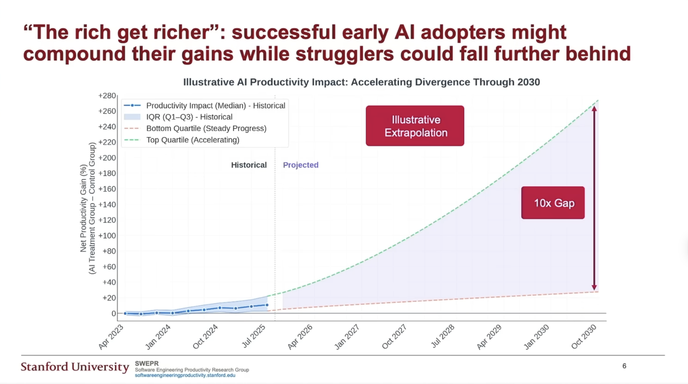
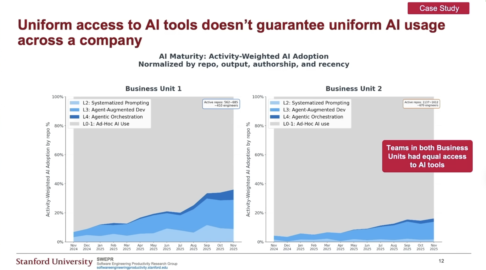
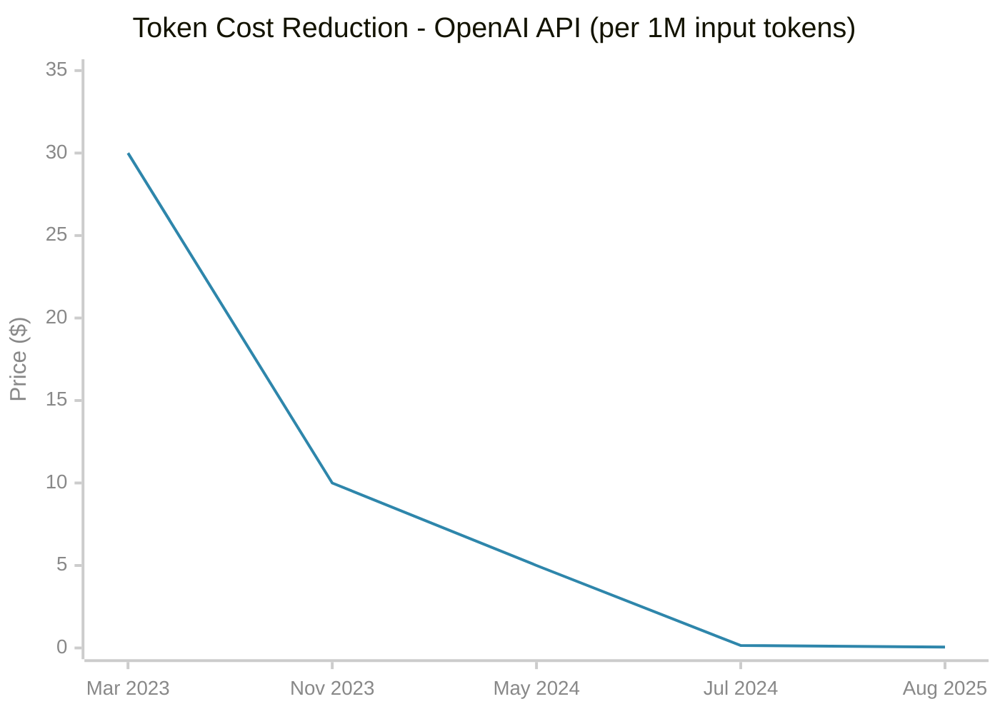
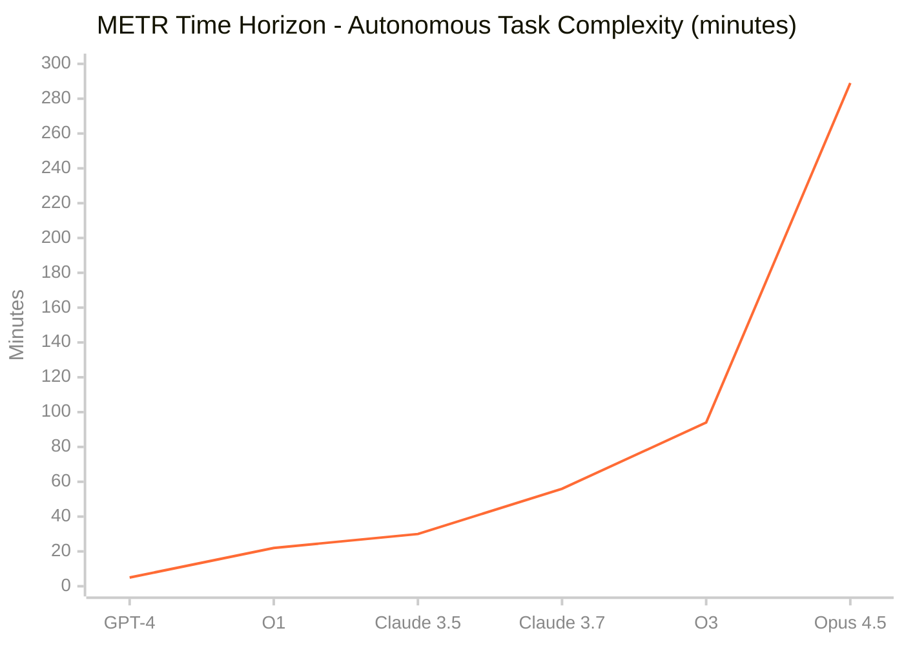
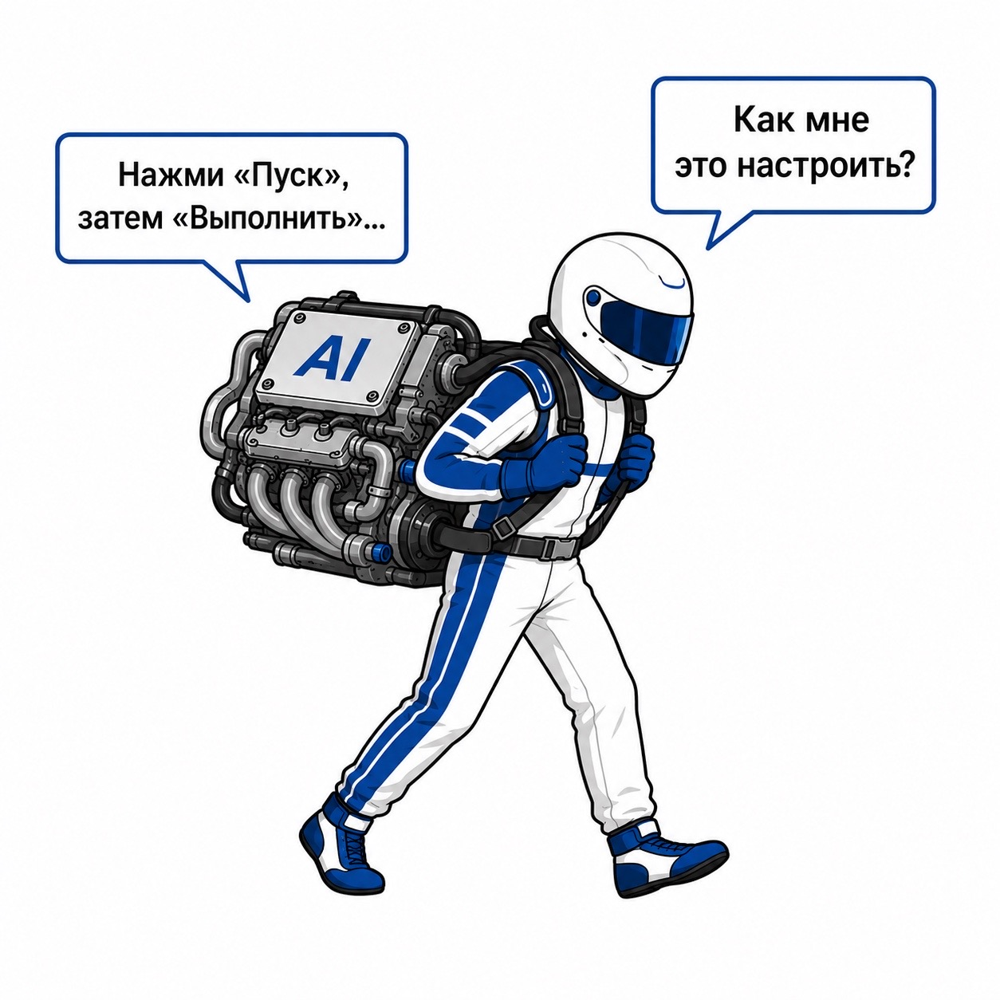
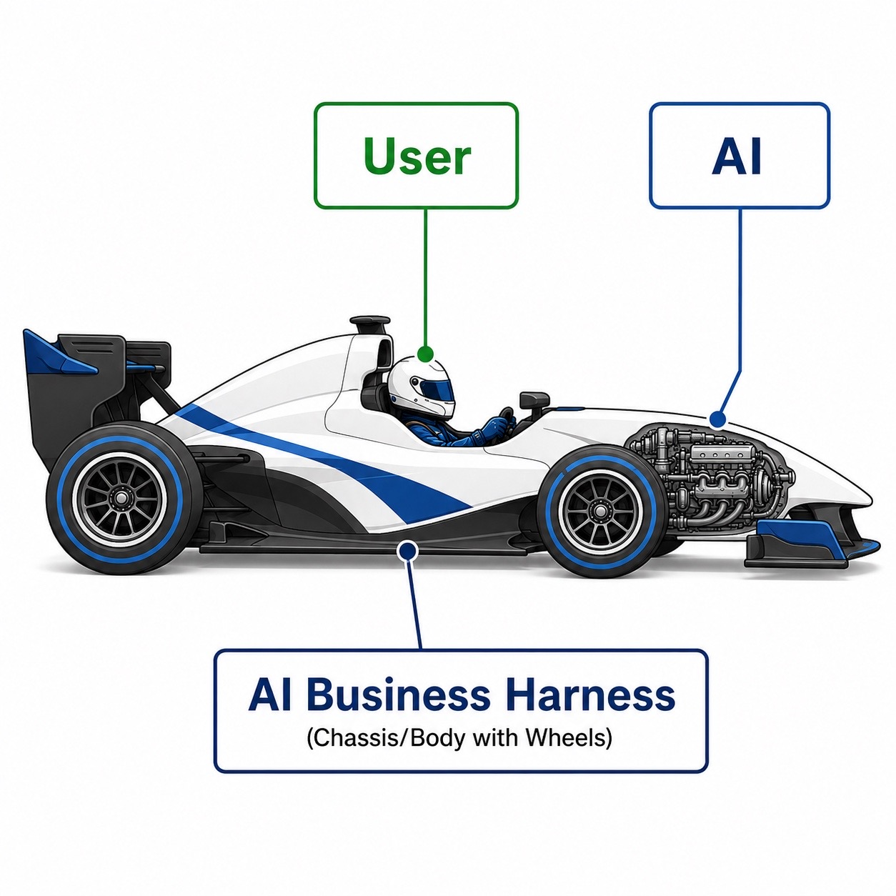

# Тренды

### Разрыв растет

*Ранние adopters наращивают преимущество, отстающие отстают еще больше. Прогноз: 10x разрыв к 2030 ([Stanford SWEPRI](https://youtu.be/tbDDYKRFjhk?si=gI1RGEbaqPx10u70))*

*Одинаковый доступ к AI-инструментам не гарантирует одинаковое использование. Два подразделения одной компании -- радикально разный уровень adoption ([Stanford SWEPRI](https://youtu.be/tbDDYKRFjhk?si=gI1RGEbaqPx10u70))*

### Стоимость токенов

**Эволюция моделей:** GPT-4 ($30) → GPT-4 Turbo ($10) → GPT-4o ($5) → GPT-4o Mini ($0.15) → GPT-5 Nano ($0.05)

*Снижение стоимости: 99.8% (в 600 раз дешевле) с марта 2023 по август 2025*

### Скорость прогресса AI

**Что измеряет:** длительность задач (в минутах работы человека), которые AI может выполнить автономно с 50% надежностью

*Рост 58x за 2 года. Удвоение каждые 4-7 месяцев ([METR Research](https://metr.org/blog/2025-03-19-measuring-ai-ability-to-complete-long-tasks/))*

> Если завтра выйдет модель с показателем в 2 раза выше -- насколько наш бизнес от этого выиграет? Как быстро мы получим бенефиты? Или их получат наши конкуренты?

---

# От чата к харнесу

### Эволюция подходов

**2023** -- Prompt Engineering: как правильно задать вопрос

**2024** -- Context Engineering: какие данные дать модели

**2025** -- Harness Engineering: как встроить AI в процессы бизнеса

### Метафора: гоночная машина

### Когда мы используем чат

### Когда у нас есть AI Business Harness

### Business Harness Engineering

Бизнес разбит на процессы. Для каждого процесса:
- какова **цена ошибки** AI?
- какова **стоимость внедрения** AI?

### Пример: Telegram-канал маркетинга

| | AI делает | Человек делает |
|---|-----------|----------------|
| **Что** | Ресерч рынка, сбор ключевых пунктов, драфт текста, создание задачи на ревью | Ревью драфта, финальный текст, решение о публикации |
| **Цена ошибки** | Низкая -- драфт никто не видит | Высокая -- плохой пост роняет доверие канала |
