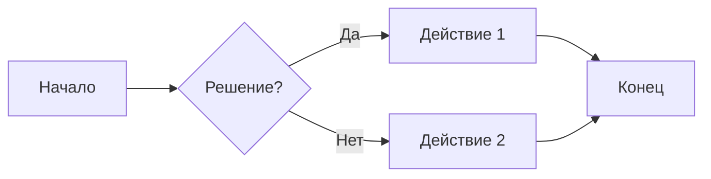
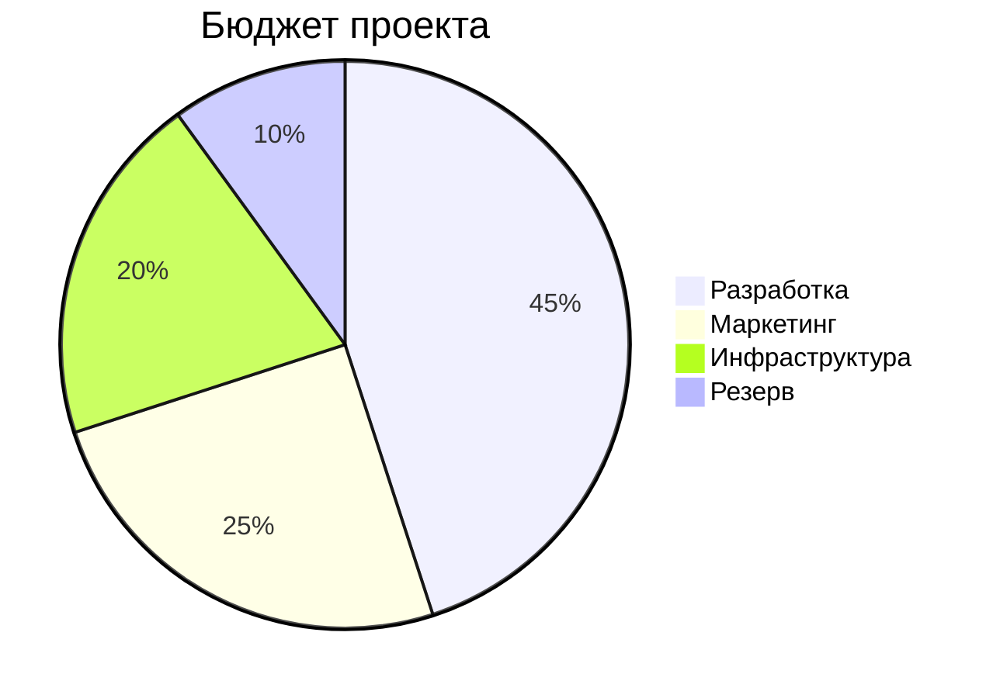
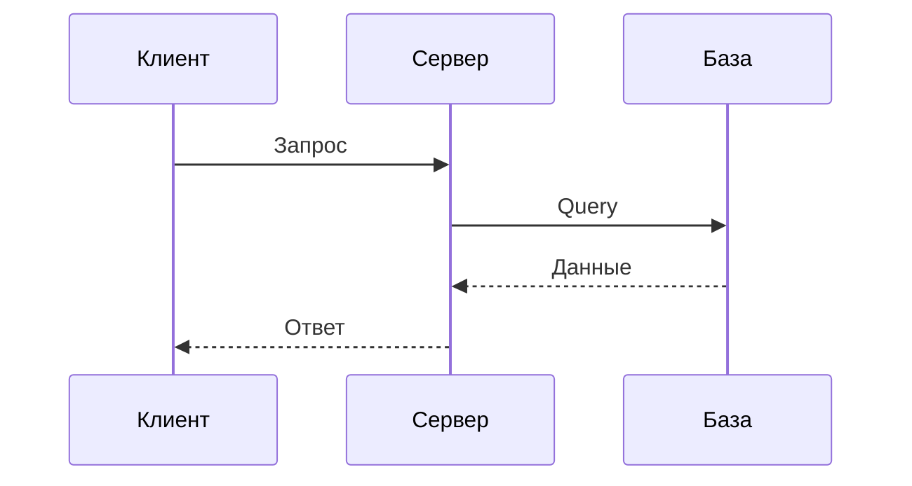
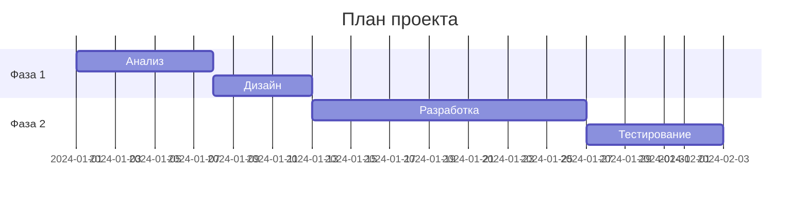
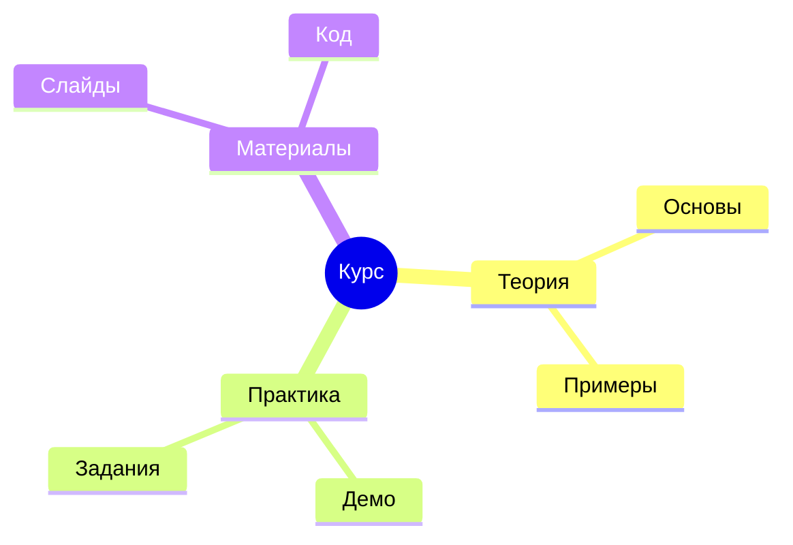

# Mermaid Demo

## Блок-схема

```mermaid
graph LR
    A[Начало] --> B{Решение?}
    B -->|Да| C[Действие 1]
    B -->|Нет| D[Действие 2]
    C --> E[Конец]
    D --> E
```

## Круговая диаграмма

```mermaid
pie title Бюджет проекта
    "Разработка" : 45
    "Маркетинг" : 25
    "Инфраструктура" : 20
    "Резерв" : 10
```

## Sequence диаграмма

```mermaid
sequenceDiagram
    Клиент->>Сервер: Запрос
    Сервер->>База: Query
    База-->>Сервер: Данные
    Сервер-->>Клиент: Ответ
```

## Gantt

```mermaid
gantt
    title План проекта
    dateFormat  YYYY-MM-DD
    section Фаза 1
    Анализ       :a1, 2024-01-01, 7d
    Дизайн       :a2, after a1, 5d
    section Фаза 2
    Разработка   :a3, after a2, 14d
    Тестирование :a4, after a3, 7d
```

## Mind Map

```mermaid
mindmap
  root((Курс))
    Теория
      Основы
      Примеры
    Практика
      Демо
      Задания
    Материалы
      Слайды
      Код
```
